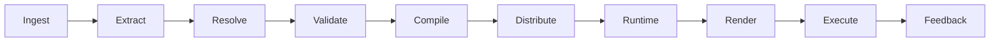

# kOA Digital Ecosystem

**A contract-driven knowledge system for canonical truth, offline Runtime Packs, and deterministic execution**

## Overview

The **kOA Digital Ecosystem** addresses a core failure mode in generative and agentic systems: **non-deterministic information drifting into downstream behavior**. kOA enforces a strict **truth boundary**:

- **Upstream is proposals** (claims derived from inputs).
- **Downstream is canonical** only after deterministic validation and compilation into **Kristal** artifacts (Exchange + Runtime Pack).

This repository contains the **system architecture**, **node responsibilities**, **kOA-owned artifact contracts**, **operational workflows**, and the broader **kOA Layer Model**. Kristal v4 remains the **sole normative source** for Kristal artifact schemas; kOA references the pinned Kristal dependency rather than duplicating those schemas.

## Key ideas

### Truth boundary

Information becomes canonical only after it is resolved into explicit structures, deterministically validated, and compiled into canonical artifacts. Downstream layers must derive from canon and must not invent new facts.

### Determinism

Given the same pinned inputs, policies, configuration, and toolchain, the system must produce identical or canonically identical outputs and stable failures. A hard gate applies: **no compile on fail**.

### Fail-closed operation

- Failed validation blocks compilation and publication.
- Failed pack verification blocks activation.
- Activation is atomic and rollback is deterministic.

### Offline-first runtime

Runtime Packs are designed for offline operation. Distribution, activation, and rollback policies preserve correctness without relying on live drifting data.

## Lifecycle



## Documentation

### Current implementation status

See [`docs/status/index.md`](docs/status/index.md) for the latest validated integration state and open gaps. Status snapshots are descriptive; ADRs and technical contracts remain authoritative.


The documentation is intentionally separated into three levels:

1. **Overview** — [`docs/1-Overview/index.md`](docs/1-Overview/index.md)
2. **Technical Reference** — [`docs/2-Technical-Reference/index.md`](docs/2-Technical-Reference/index.md)
3. **Layer Model** — [`docs/3-Layer-Model/README.md`](docs/3-Layer-Model/README.md)

The complete documentation map is in [`docs/index.md`](docs/index.md).

## Repository layout

```text
kOA_Digital_Ecosystem/
├── README.md
├── LICENSE
├── GitSink.bat
├── .gitignore
├── .gitattributes
└── docs/
    ├── index.md
    ├── status/
    ├── 1-Overview/
    ├── 2-Technical-Reference/
    │   ├── 00-overview/
    │   ├── 10-system/
    │   ├── 20-nodes/
    │   ├── 30-artifacts/
    │   ├── 40-integration/
    │   ├── 50-operations/
    │   ├── 60-guides/
    │   └── 90-reference/
    └── 3-Layer-Model/
        └── layers/
```

## Conformance testing

Implementations should demonstrate deterministic rebuilds, fail-closed verification, deterministic rollback, and deterministic rendering with trace coverage. See [`docs/2-Technical-Reference/40-integration/kristal-v4/conformance.md`](docs/2-Technical-Reference/40-integration/kristal-v4/conformance.md).

## Start here

1. [`docs/index.md`](docs/index.md)
2. [`docs/1-Overview/index.md`](docs/1-Overview/index.md)
3. [`docs/2-Technical-Reference/00-overview/system-at-a-glance.md`](docs/2-Technical-Reference/00-overview/system-at-a-glance.md)
4. [`docs/2-Technical-Reference/10-system/architecture.md`](docs/2-Technical-Reference/10-system/architecture.md)
5. [`docs/2-Technical-Reference/20-nodes/index.md`](docs/2-Technical-Reference/20-nodes/index.md)
6. [`docs/3-Layer-Model/README.md`](docs/3-Layer-Model/README.md)
7. [`docs/status/index.md`](docs/status/index.md)
