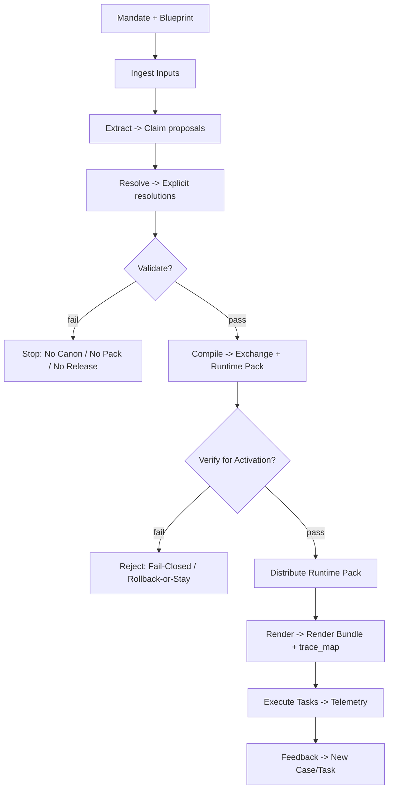

# kOA Digital Ecosystem

kOA is a **contract-driven pipeline** that turns raw inputs into **validated, canonical knowledge** (via Kristal) and then safely **distributes and uses** that knowledge in **offline-capable** products and workflows.

This wiki focuses on **features**, **operational behavior**, and **how the pieces fit together**—without diving into schema-level technicalities.

---

## System at a glance

### The stage spine (end-to-end)

1. **Ingest** raw inputs (snapshots + provenance)
2. **Extract** structured proposals (claims)
3. **Resolve** ambiguity (entities, properties, literals)
4. **Validate** deterministically (accept/reject with a report)
5. **Compile** canonical knowledge + a portable offline pack
6. **Distribute** packs with fail-closed verification
7. **Render** deterministic user-facing output with trace coverage
8. **Execute** work (tasks) with telemetry
9. **Feedback** becomes new governed work (never mutates canon)

---

## Core components (who does what)

* **Orgo (control plane):** orchestrates stages, enforces gates, turns governed Signals into immutable WorkflowVersion-driven Cases/Tasks, records operational evidence, and drives durable external effects through IntegrationOperations/outbox delivery.
* **SenTient (resolver):** turns ambiguous surfaces into explicit resolution outputs (keeps ambiguity explicit when unresolved).
* **Kristal (truth pivot):** compiles canonical truth artifacts (Exchange) and derived offline artifacts (Runtime Pack).
* **Konnaxion / eThikos (civic decision + platform):** structures deliberation and finalized decisions in eThikos, can push finalized decision handoffs directly to Orgo, and also provides distribution/runtime-pack capabilities where deployed.
* **Architect (renderer):** produces deterministic outputs that cannot introduce new facts and must trace.
* **SwarmCraft (execution):** executes tasks under constraints; emits telemetry.

---

## The rules that keep the ecosystem safe

* **Truth boundary:** only validated + compiled artifacts become canonical; downstream does not mutate canon.
* **No compile on fail:** failed validation blocks compilation/publication.
* **Fail-closed distribution:** verification/compatibility must pass before activation; otherwise stay on current/last-known-good.
* **Atomic activation + deterministic rollback:** no partial activation; rollback is explicit and reproducible.
* **No new facts downstream:** rendering must trace to validated lineage or refuse deterministically.

See: [Principles & invariants](Principles-and-invariants.md)

---

## What this wiki covers (and what it doesn’t)

### In scope here

* What each component is responsible for, and how they cooperate
* Operational behavior: gates, releases, rollback, observability, incident response
* Integration expectations (without duplicating external specs)

### Out of scope (by design)

* Field-level Kristal schemas, canonicalization mechanics, signature formats, etc.

See: [Non-goals](Non-goals.md)

---

## How to navigate

* Want the flow: [Lifecycle](Lifecycle.md)
* Want the parts: [Components](Components.md)
* Want what crosses boundaries: [Artifacts](Artifacts.md)
* Want how it runs in production: [Operations](Operations.md)
* Want external integration: [Integration](Integration.md)
* Need vocabulary and quick answers: [Glossary](Glossary.md), [FAQ](FAQ.md)

---

## Who this is for

* **Implementers:** building services that produce/consume artifacts and participate in gates
* **Integrators:** connecting external systems to ingestion, distribution, or rendering
* **Operators:** running builds, releases, rollbacks, incident response, and audits
* **Architects:** evolving contracts and invariants through ADRs

