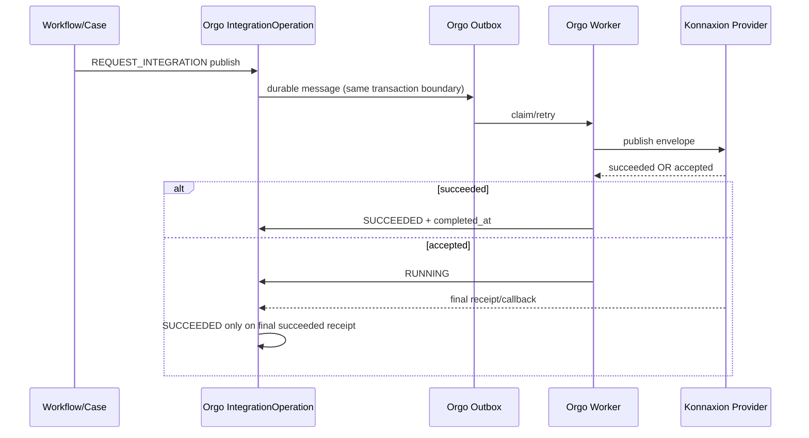

# Orgo → Konnaxion Durable Publish Profile

**Normative for kOA:** NO — implementation/integration profile for the current Orgo↔Konnaxion bridge  
**External normative reference:** none; Orgo and Konnaxion own their respective runtime contracts

---

## 1) Purpose

Document the current durable publication path from **Orgo operational work** into a **Konnaxion-owned mutation boundary** without shared mutable database access.

This profile was validated while building the UCKK A014 demonstration vertical slice. It is intentionally narrower than the full kOA distribution model: the demonstrated provider operation is `publish` of an operational Impact/accountability update, not Runtime Pack activation.

---

## 2) Authority and trigger model

The A014 demonstration separates advisory computation from institutional authority:

```text
Konnaxion deliberation / Smart Vote reading
            ↓ advisory only
UCKK Assembly publishes decision D009
            ↓ authoritative trigger
UCKK-Moodle / adapter emits normalized Signal
            ↓
Orgo WorkflowVersion evaluates Signal
            ↓
Case + Tasks
```

A favorable computed/advisory reading MUST NOT be treated as the trigger for operational execution. The trigger is the published institutional decision.

Stable demonstration references:

```text
demo_id              uckk-pedagogy-pilot-a014
assembly              UCKK-A014
decision              UCKK-D009
archive               UCKK-ARCH-A014-D009
workflow              uckk_pedagogy_pilot
case external ref     uckk:assembly:A014:decision:D009:v1
correlation           corr.uckk.A014.D009
```

Runtime UUIDs are not stable contract identifiers and must not be hardcoded into reusable scenario packs.

---

## 3) Orgo durable-effect model

A durable external effect follows this sequence:



The implementation maintains two distinct state machines:

- **IntegrationOperation** — business-facing external publication status.
- **OutboxMessage** — transport/delivery retry status.

The external operation is not the same thing as the Case or Task status.

---

## 4) Provider envelope and transport requirements

Current Orgo Konnaxion adapter configuration uses runtime variables:

```text
KONNAXION_BRIDGE_URL
KONNAXION_BRIDGE_TOKEN
```

The token is a runtime secret and must not be persisted in documentation, source fixtures, scenario packs, or logs.

The HTTP bridge propagates:

```text
Authorization: Bearer <runtime-secret>
Idempotency-Key: <business-idempotency-key>
X-Correlation-ID: <correlation-id>
```

Development localhost HTTP is acceptable for the local demonstration environment; production deployment must use the environment's security profile.

Allowed Orgo-side Konnaxion operations currently include `publish` and `distribute`; the demonstrated gold path uses `publish`.

---

## 5) Konnaxion ownership and World scoping

The provider endpoint is scoped to the selected **Konnaxion World**. In the validated A014 setup:

```text
World                uckk-a014
Release              r1
World status         READY
Promoted release     CURRENT
```

The provider performs the mutation using Konnaxion-owned application/service logic in the selected World/Release context. Orgo MUST NOT update Konnaxion tables directly.

For the A014 J30 Impact, the stable business identifiers are:

```text
external_reference   impact:UCKK-A014:day30:v1
idempotency_key      uckk:A014:impact:J30:v1
correlation_id       corr.uckk.A014.D009
synthetic            true
checkpoint           day_30
```

The provider must suppress duplicate business effects for the same idempotency key.

---

## 6) Receipt semantics

Provider result semantics are strict:

### `succeeded`

Terminal success. Orgo may mark the IntegrationOperation `SUCCEEDED` and record completion.

### `accepted`

Non-terminal durable acceptance. Orgo keeps the operation running and waits for a final receipt/callback.

Therefore:

```text
accepted != succeeded
```

A caller/waiter must fail closed:

- `SUCCEEDED` → complete
- `FAILED` → fail
- timeout without terminal success → fail

---

## 7) Retry and redrive

Provider unavailable/unconfigured failures are retried through the outbox policy. If retries are exhausted, the transport item can become terminal/dead and the IntegrationOperation failed.

Recovery rules:

1. Fix/restore provider configuration first.
2. Inspect the existing operation and outbox message.
3. Do not create a second J30 request blindly.
4. Redrive through the canonical Orgo API/manager action so IntegrationOperation and outbox state remain coherent.
5. Reuse the original business idempotency key for provider processing.
6. Verify the provider-owned business effect exists exactly once.
7. Only then advance dependent scenario checkpoints.

Direct SQL mutation across systems is prohibited. Direct SQL repair of Orgo integration state is also not the normal redrive mechanism.

---

## 8) Demonstration checkpoint rule

For UCKK A014:

```text
T-14    PASS
T-7     PASS
T0-pre  PASS
T0-post PASS
J3      PASS
J30     request created; final provider publication still requires successful redrive/verification
J90     BLOCKED until J30 is terminal SUCCEEDED and exactly one Konnaxion Impact is verified
```

This checkpoint ordering is part of the demonstration's validation discipline, not a universal kOA lifecycle rule.

---

## 9) Security and logging

- Never log bridge bearer tokens.
- Never persist the generated bridge token in the World pack or repository.
- Database credentials are environment configuration, not integration-contract documentation.
- Preserve correlation/idempotency identifiers in logs because they are required for audit and redrive diagnosis.
- Keep synthetic/demo provenance explicit (`synthetic: true`, epistemic/demo fixture markers where applicable).

---

## 10) Related pages

- Orgo node: `../../20-nodes/gevurah-orgo.md`
- Konnaxion node: `../../20-nodes/chesed-konnaxion.md`
- Failure modes: `../../10-system/failure-modes.md`
- Integrator guide: `../../60-guides/integrators.md`
- Validation snapshot: `uckk-a014-validation-2026-09-12.md`
