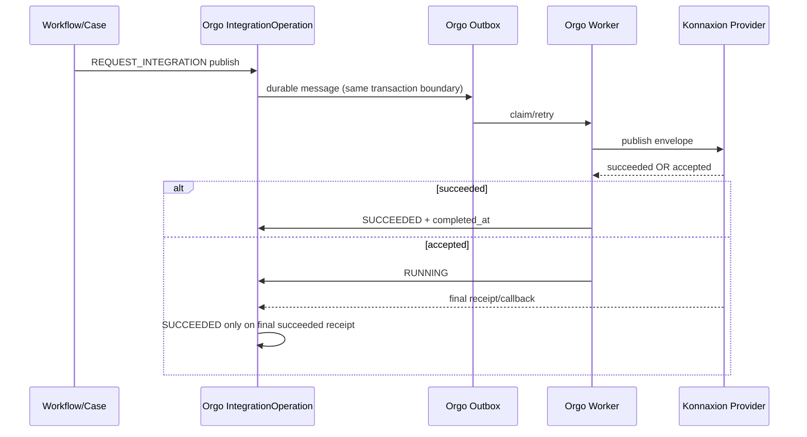

# Konnaxion/eThikos ↔ Orgo Decision and Durable Publish Profile

> **2026-09-21 qualification update:** The direct Konnaxion/eThikos ↔ Orgo path is now qualified in an integrated local runtime for `governance.decision.execute/1.0.0` and `accountability.impact.publish/1.0.0`. The run demonstrated durable DecisionRecord delivery into Orgo, Signal→Workflow→Case→Task execution, durable impact publication back to Konnaxion, idempotent replay, and divergent replay rejection. See `../../../status/2026-09-21-konnaxion-orgo-ik-e2e-qualification.md`.
>
> **Historical note:** The 2026-09-16 mapping and older UCKK-A014 evidence remain useful for migration traceability, but they are no longer the latest conformance state for this boundary.


**Normative for kOA:** YES for ecosystem mapping; product implementation remains owned by Konnaxion/Orgo  
**External normative reference:** none; Konnaxion and Orgo own their respective runtime contracts

---

## 1) Purpose

Document the two-way operational boundary between **Konnaxion/eThikos** and **Orgo** without shared mutable database access:

```text
Konnaxion / eThikos
→ finalized decision
→ direct decision handoff
→ Orgo Signal / Workflow / Case / Tasks

Orgo operational observations / impact
→ IntegrationOperation + Outbox
→ Konnaxion provider boundary
→ Konnaxion-owned Impact / accountability state
```

**UCKK is optional in this path.** It may publish, display, relay, teach, or distribute information, but it is not the owner of the eThikos decision and is not a mandatory relay between Konnaxion and Orgo.

The current implementation work was originally exercised with a historical `UCKK-A014` fixture. That fixture name and its old identifiers are retained only for traceability until the runtime scenario is renamed/refactored; they do **not** define authority.

---

## 2) Decision authority and direct trigger model

For decisions produced by the civic decision flow described here, the authoritative decision is finalized **inside Konnaxion/eThikos**.

```text
Konnaxion / eThikos deliberation
            ↓
Smart Vote / EkoH / other readings
            ↓ advisory inputs / transparent lenses
ethiKos decision stage
            ↓
finalized DecisionRecord
            ↓ authoritative operational trigger
Konnaxion → Orgo decision handoff
            ↓
normalized Orgo Signal
            ↓
Published WorkflowVersion
            ↓
Case + Tasks
```

Rules:

- A Smart Vote result is a reading/input unless the eThikos decision contract explicitly says otherwise; it is not by itself the cross-system trigger.
- The **finalized eThikos DecisionRecord** is the source event that may trigger governed work in Orgo.
- Orgo does not decide the civic outcome; it turns an accepted decision handoff into operational work.
- UCKK may consume or distribute the decision independently, but Orgo does not depend on UCKK for the decision handoff.

### Historical A014 identifiers

The currently tested fixture still contains names such as:

```text
demo_id              uckk-pedagogy-pilot-a014
workflow              uckk_pedagogy_pilot
correlation           corr.uckk.A014.D009
J30 Impact ref        impact:UCKK-A014:day30:v1
J30 idempotency       uckk:A014:impact:J30:v1
```

These are **legacy fixture identifiers**, not architectural ownership claims. They should be replaced by Konnaxion/eThikos-owned decision references when the scenario is refactored. Runtime UUIDs are never stable contract identifiers and must not be hardcoded into reusable scenario packs.

---

## 3) Konnaxion/eThikos → Orgo decision handoff

The inbound contract should be small and decision-centric. A handoff carries only what Orgo needs to create governed work, for example:

```text
source_system          Konnaxion
source_module          eThikos
decision_ref           stable eThikos decision identity
decision_status        finalized/published according to eThikos contract
organization/scope     target Orgo scope
operation              decision handoff / governed-work request
correlation_id         stable cross-system correlation
idempotency_key        stable replay identity
payload                 minimum operational mandate/context
provenance             source refs / decision record refs
```

The receiver validates/authenticates the handoff and then mutates only Orgo-owned state.

```text
Konnaxion/eThikos DecisionRecord
→ authenticated/versioned boundary
→ Orgo validates scope + replay identity
→ Signal persisted/deduplicated
→ WorkflowVersion evaluation
→ Case/Tasks
```

Konnaxion MUST NOT write Orgo Task/Case tables directly. Orgo MUST NOT query Konnaxion tables as a substitute for the handoff contract.

---

## 4) Orgo durable-effect model

A durable external effect from Orgo follows this sequence:



The implementation maintains two distinct state machines:

- **IntegrationOperation** — business-facing external publication status.
- **OutboxMessage** — transport/delivery retry status.

The external operation is not the same thing as the Case or Task status.

---

## 5) Provider envelope and transport requirements

Current Orgo Konnaxion adapter configuration uses runtime variables:

```text
KONNAXION_BRIDGE_URL
KONNAXION_BRIDGE_TOKEN
```

The token is a runtime secret and must not be persisted in documentation, source fixtures, scenario packs, or logs.

The HTTP bridge propagates:

```text
Authorization: Bearer <runtime-secret>
Idempotency-Key: <business-idempotency-key>
X-Correlation-ID: <correlation-id>
```

Development localhost HTTP is acceptable for the local demonstration environment; production deployment must use the environment's security profile.

Allowed Orgo-side Konnaxion operations currently include `publish` and `distribute`; the demonstrated outbound path uses `publish`.

---

## 6) Konnaxion ownership and World scoping

The outbound provider endpoint may be scoped to a selected **Konnaxion World** and promoted/current Release. The provider performs the mutation using Konnaxion-owned application/service logic in that context. Orgo MUST NOT update Konnaxion tables directly.

For the historical A014 day-30 fixture, the current runtime identifiers are:

```text
World                uckk-a014
Release              r1
external_reference   impact:UCKK-A014:day30:v1
idempotency_key      uckk:A014:impact:J30:v1
correlation_id       corr.uckk.A014.D009
synthetic            true
checkpoint           day_30
```

These identifiers remain useful for recovering the existing runtime state, but they are not the target naming model for the corrected Konnaxion/eThikos decision flow.

The provider must suppress duplicate business effects for the same idempotency key.

---

## 7) Receipt semantics

Provider result semantics are strict.

### `succeeded`

Terminal success. Orgo may mark the IntegrationOperation `SUCCEEDED` and record completion.

### `accepted`

Non-terminal durable acceptance. Orgo keeps the operation running and waits for a final receipt/callback.

Therefore:

```text
accepted != succeeded
```

A caller/waiter must fail closed:

- `SUCCEEDED` → complete
- `FAILED` → fail
- timeout without terminal success → fail

---

## 8) Retry and redrive

Provider unavailable/unconfigured failures are retried through the outbox policy. If retries are exhausted, the transport item can become terminal/dead and the IntegrationOperation failed.

Recovery rules:

1. Fix/restore provider configuration first.
2. Inspect the existing operation and outbox message.
3. Do not create a duplicate request blindly.
4. Redrive through the canonical Orgo API/manager action so IntegrationOperation and outbox state remain coherent.
5. Reuse the original business idempotency key for provider processing.
6. Verify the provider-owned business effect exists exactly once.
7. Only then advance dependent scenario checkpoints.

Direct SQL mutation across systems is prohibited. Direct SQL repair of Orgo integration state is also not the normal redrive mechanism.

---

## 9) UCKK optional distribution role

UCKK is outside the mandatory decision→execution boundary.

Possible optional flows include:

```text
Konnaxion/eThikos finalized decision
→ UCKK publication/distribution/presentation

Konnaxion/eThikos finalized decision
→ Orgo governed-work handoff
```

These flows may occur independently or in parallel. Failure/unavailability of UCKK must not prevent Konnaxion from handing a finalized decision to Orgo unless a specific deployment policy explicitly adds that dependency.

UCKK does not become authoritative merely because it displays or republishes a decision.

---

## 10) Qualification status

### Current direct IK qualification — 2026-09-21

The corrected two-way path has now been exercised successfully through the real product runtimes:

```text
Konnaxion/eThikos finalized DecisionRecord
→ InteractionEmission
→ governance.decision.execute/1.0.0
→ Orgo Signal
→ Published WorkflowVersion
→ Case + Task
→ IntegrationOperation
→ accountability.impact.publish/1.0.0
→ Konnaxion OrgoImpactPublication
```

Observed terminal results:

- Konnaxion emission: `delivered` in one attempt;
- Orgo Signal: `PROCESSED`;
- Orgo impact IntegrationOperation: `SUCCEEDED`;
- Konnaxion impact publication: persisted and confirmed;
- same-key/same-semantics replay: accepted without duplicate Signal or impact;
- same-key/divergent-semantics replay: rejected with HTTP 409 / `IK_IDEMPOTENCY_CONFLICT`.

Therefore the direct inbound decision path and the outbound durable impact path are both qualified for the Profile/version pairs named above in the tested local integrated runtime.

Canonical evidence: `../../../status/2026-09-21-konnaxion-orgo-ik-e2e-qualification.md`.

### Historical A014 evidence

The older A014 runs remain historical evidence of Orgo workflow mechanics, Konnaxion provider behavior, retry/redrive, and durable publication recovery. They are retained for traceability but no longer represent the latest inbound authority model.

UCKK remains optional to the qualified direct Konnaxion→Orgo path.

---

## 11) Security and logging

- Never log bridge bearer tokens.
- Never persist generated bridge tokens in World packs or repositories.
- Database credentials are environment configuration, not integration-contract documentation.
- Preserve correlation/idempotency identifiers in logs because they are required for audit and redrive diagnosis.
- Keep synthetic/demo provenance explicit.
- Machine-to-machine decision handoff must use dedicated service credentials/scopes, not a human SSO session.

---

## 12) Related pages

- Orgo node: `../../20-nodes/gevurah-orgo.md`
- Konnaxion node: `../../20-nodes/chesed-konnaxion.md`
- Decision layer: `../../../3-Layer-Model/layers/07_decision_legitimacy.md`
- Failure modes: `../../10-system/failure-modes.md`
- Integrator guide: `../../60-guides/integrators.md`
- Historical validation snapshot: `uckk-a014-validation-2026-09-12.md`
- Architecture decision: `../../90-reference/adr/adr-0007-konnaxion-ethikos-decision-authority.md`
